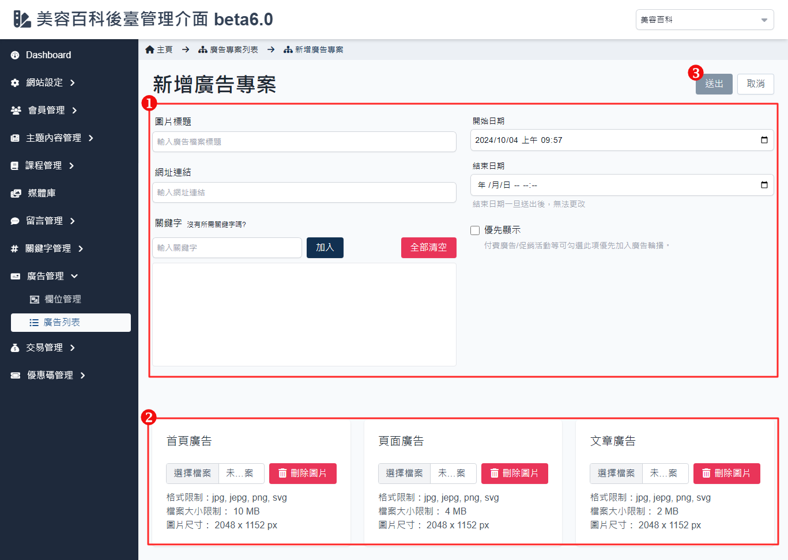

# 新增廣告專案

提供了管理者創建新的廣告專案的功能，包含基本資料的填寫、圖片上傳及配置，幫助管理者有效地完成廣告專案的設定。

## 操作說明

1. **基本設定**：
    - **圖片標題**：輸入廣告的標題，以便於管理和區分不同廣告。
    - **網址連結**：輸入廣告的跳轉連結，當用戶點擊廣告時將導向該連結地址。
    - **關鍵字設定**：
        - **加入關鍵字**：輸入與該廣告相關的關鍵字，方便後續查找和管理，輸入後點擊「加入」按鈕添加至列表。
        - **全部清空**：點擊「全部清空」按鈕可清除所有已輸入的關鍵字，進行重新設置。
    - **開始日期與結束日期**：
        - **開始日期**：設置廣告開始展示的日期和時間。
        - **結束日期**：設置廣告結束展示的日期。
    - **優先顯示**：勾選此選項可以將該廣告設置為優先顯示，適用於付費廣告或促銷活動，以提高廣告的曝光率。
2. **廣告圖片設定**：依照首頁、文章列表、文章詳情頁面所顯示的廣告進行設定。
    - **選擇檔案**：點擊「選擇檔案」上傳首頁廣告的圖片。
    - **格式限制**：支持的圖片格式包括 jpg、jpeg、png、svg，文件大小依照不同頁面不得超過 2 ~ 10 MB。
    - **圖片尺寸**：建議的圖片尺寸也因不同頁面會有所差異。
    - **刪除圖片**：點擊「刪除圖片」按鈕可移除已上傳的圖片。
3. **送出與取消操作**：
    - **送出**：點擊「送出」按鈕保存所有設定，新增廣告專案。
    - **取消**：點擊「取消」按鈕撤銷所有未保存的變更。

