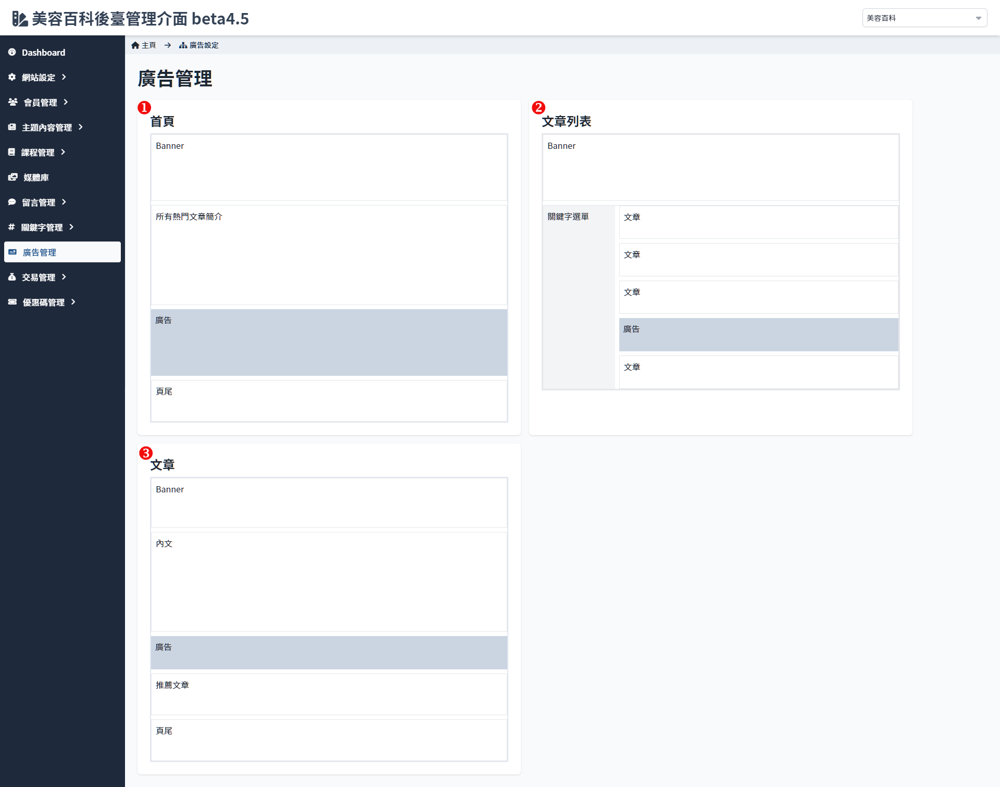

# 欄位管理

提供了管理者設置首頁廣告及內容顯示的相關設置，方便對首頁的橫幅、廣告等區域進行有效的管理和配置。

## 廣告管理

進入欄位管理會先顯示首頁、文章列表以及文章內容的廣告配置，顯示各頁面中顯示的內容，並標示出廣告出現的區塊，點擊「廣告」可進入至 [欄位內容設定](./position-list.md#欄位內容設定) 進行編輯設置。

## 欄位內容設定

### 操作說明

1. **欄位標題**：顯示當前設定的欄位名稱。
2. **欄位內容設定**：
    - **輪播時間**：設置廣告輪播時間間隔，單位為秒。例如，設定為「3」秒表示圖片將顯示 3 秒後自動切換。
    - **尺寸規範**：設置廣告圖片的建議尺寸，確保圖片在顯示時保持適當比例。
    - **檔案大小限制**：設置可上傳圖片的大小上限，單位為MB。
3. **關鍵字設定**：
    - **關鍵字欄位**：可以在此輸入與該欄位相關的關鍵字，便於分類和管理。輸入完畢後點擊「加入」按鈕，即可將關鍵字添加至列表。
    - **全部清空**：點擊「全部清空」按鈕可以一次性清除所有已輸入的關鍵字，方便進行重新設定。
4. **廣告位置預覽**：
    - **首頁**：顯示當前在首頁配置的廣告及內容顯示區域，包括「Banner」、「所有熱門文章簡介」、「廣告位置」以及「頁尾」等欄位，管理者可以直觀地查看配置情況。
5. **套用更新與取消操作**：
    - **套用更新**：點擊「套用更新」按鈕保存所有更改，使配置立即生效。
    - **取消**：點擊「取消」按鈕撤銷所有未保存的變更，恢復至之前的設定狀態。

