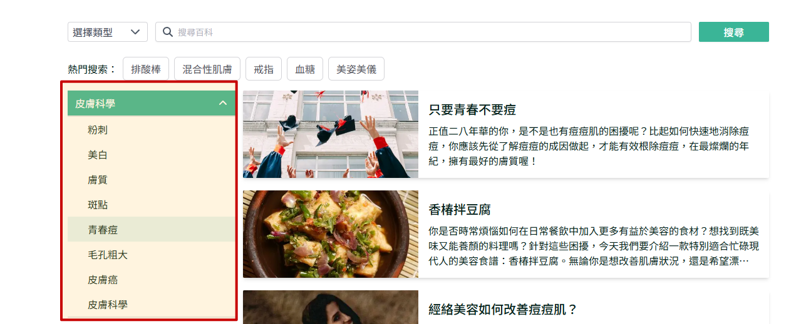
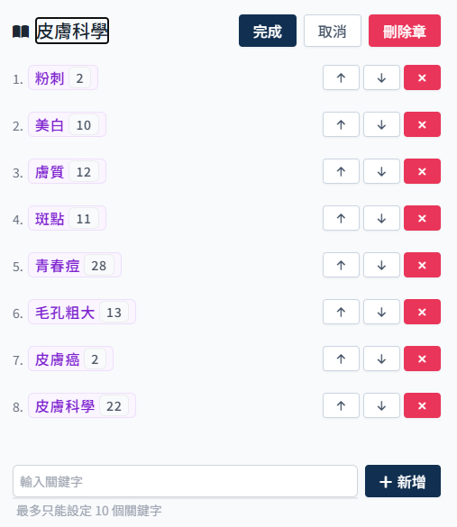
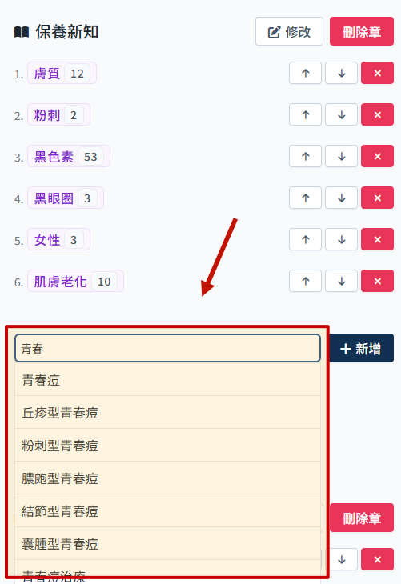
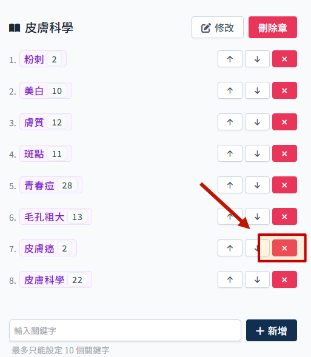

# 如何調整章節

網站內文章列表顯示哪些文章，由章節管理設定。

## 進入章節管理頁面

1. 點選 sidebar `主題內容管理` 展開子選單，選擇 `章節管理`

    

2. 進入章節管理頁面

    

章節管理這裡即對應前端網站顯示畫面:

## 進行章調整

:::danger

做任何變動都要記得最後都需要點擊 套用變更 才會生效!!

:::

### 修改章節名稱

:::warning

-   章節名稱不可重複。
    :::

1. 點擊 `修改`

    

2. 此時可編輯章節名稱

    

3. 修改完成後點擊 `完成`

    

4. 套用變更
   

### 新增章

:::warning

-   至多上限 6 個章。
-   章節名稱不可重複。
    :::

1. 輸入章節名稱

    

2. 點選 `新增 後，會出現一個新的章節欄位
   

3. 必須為新增的章添加至少一個小節
    > 參考 [新增小節](#新增小節)

### 刪除章

:::warning 至少需保留一個章。
:::

1. 點擊 刪除章

    

2. 套用變更

    

## 小節調整

### 調整顯示順序

-   可依照需求調整小節排列順序。

1. 點擊上下方向鍵，可調整順序

    

2. 套用變更

    

### 新增小節

:::warning

-   僅可新增已有的關鍵字作為小節。
-   最多設定 10 個關鍵字。
-   同個章內不可新增重複小節。

    :::

1. 輸入要新增的關鍵字

    偵測到輸入行為會自動出現下拉選單供選擇，建議直接從下拉選單選比較不會有問題。

    

2. 點擊新增

    

3. 套用變更

    

### 刪除小節

:::warning

-   每個章至少需要設定一個小節。
    :::

1. 點擊 `刪除`，直接刪除小節

    

2. 套用變更

    
