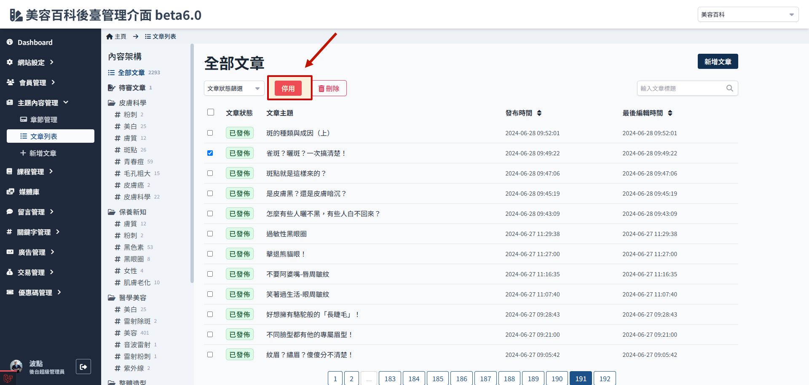

# 如何修改文章內容

僅`草稿`、`停用` 狀態的文章可進行編輯。

> 文章狀態請參考[文章狀態與限制說明](./article-status.md)。

### 發佈狀態的文章

1. 進入文章列表
   

2. 選取要修改的文章
   

3. 點擊停用
   

4. 此時文章狀態會變成停用狀態
   

5. 進入文章內容頁面就會看到欄位變成可編輯狀態
   

### 待審核狀態的文章

1. 進入文章列表，選取要修改的文章
   

2. 進入文章內容頁面
   

3. 拉到底部，選擇取消送審，此時進入文章內容頁面就會看到欄位變成可編輯狀態
   

4. 從文章列表檢視，文章會變成停用狀態
   
