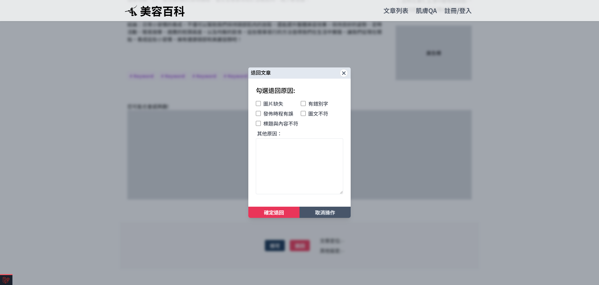

# 審核文章操作

僅擁有審核權限的帳號可操作此功能。

> 帳號權限請參考[管理員帳號層級說明](../../center/admin/administer-rules.md)。

1. 從文章列表進入待審文章列表

    

2. 選取要審核的文章

    

3. 進入審核文章內容頁面
   

4. 拉到底部，進行審核操作
   

5. 核可或者退回

    - 5-1. 核可：核可文章會跳出再確認的視窗。
      
      :::note
      若文章沒有設定排程，核可後文章會立即發布。若文章有設定排程且未到指定發布時間，文章會依照指定時間才發布，若已超過排程的時間，則會立即發布。
      :::
       
    - 5-2. 退回：退回文章需勾選原因。
      
      退回後文章狀態變更為 已退回，參考[文章被退回怎麼處理](./deal-with-reject-article.md)。
