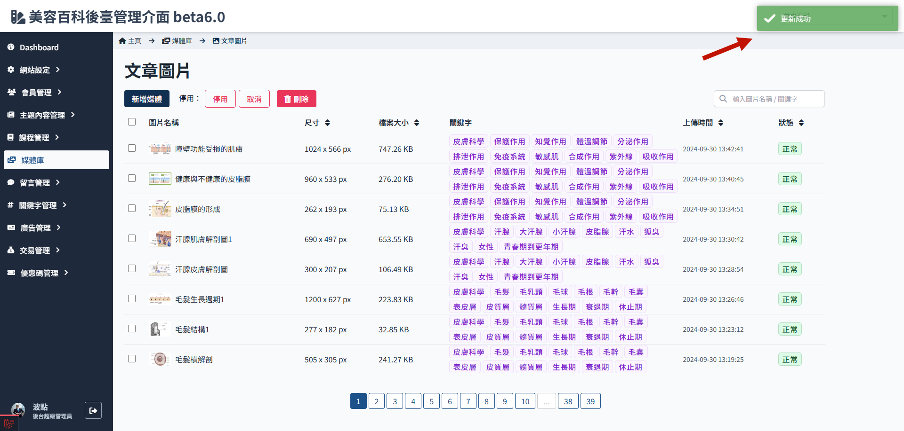
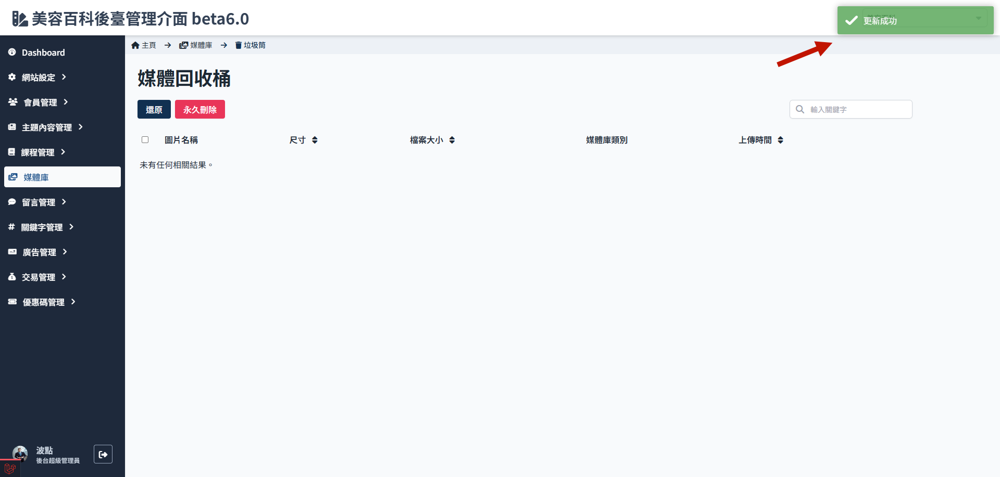

# 刪除與還原媒體

:::warning
這邊的刪除是把媒體移動到媒體回收桶，雖然是可還原操作，但一旦刪除了前端網頁上媒體就會是死圖，務必謹慎操作！
:::

> 關於媒體資料夾的編輯操作功能，參考[媒體狀態與類別](./media-status.md#類別說明)。

## 如何刪除媒體

1. 媒體庫，進入文章圖片資料夾
   

2. 勾選要刪除的媒體
   

3. 點選刪除
   

4. 二次確認，點擊確定

    

5. 媒體會從列表中消失 -> 移動到媒體回收桶
   
   

## 如何還原媒體

1. 媒體庫，進入媒體回收桶
   

2. 勾選要還原的媒體
   

3. 點選還原
   

4. 媒體會同回收桶消失 -> 回到原本資料夾
   
   
