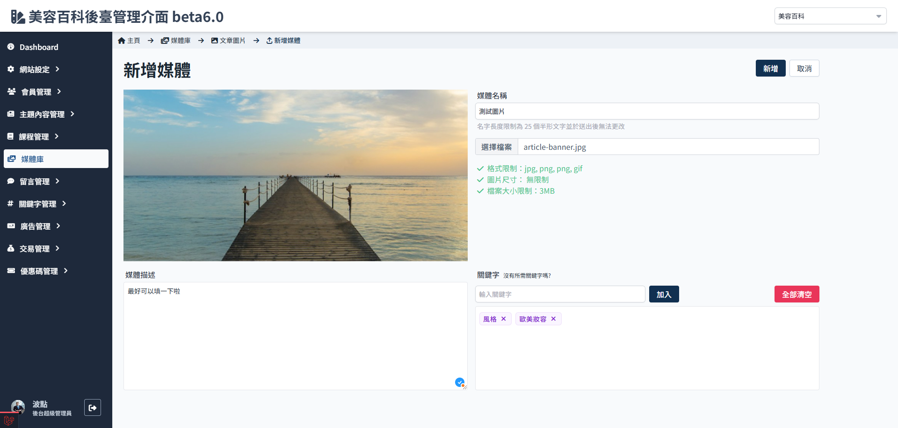

# 新增圖片到文章圖片資料夾

1. 媒體庫，進入文章圖片資料夾
   

2. 點選新增媒體
   

3. 輸入媒體資訊
   

    - 媒體名稱：不可重複，搜索圖片的主要方式。
    - 圖片格式、尺寸、檔案大小限制均依照資料夾類別的限制，不符合者無法成功上傳。
    - 圖片敘述，非必填，但會影響SEO。
    - 圖片關鍵字，必填，按照圖片內容設定。

4. 點選 新增
   
