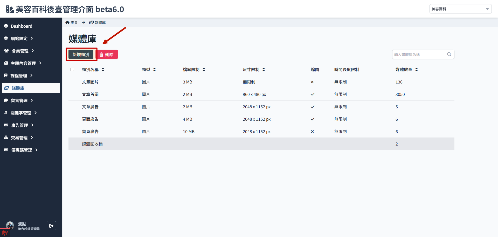

# 如何新增媒體類別

1. 進入媒體庫，點選 新增類別
   

2. 設定類別限制
   :::danger
   類別資料夾的媒體限制僅在建立時可以設定，之後不可修改！！
   :::

    

    - 類別名稱：設定資料夾的名稱。
    - 檔案類型：可選擇為圖片或影片（影片相關功能目前尚未開發）。
    - 使用位置：
    - 路徑資料夾名稱：後台存放檔案的資料夾名稱，通常
    - 尺寸限制：設定尺寸限制，須完全符合尺寸規範，不符合的媒體無法上傳至此資料夾內。
    - 檔案大小限制：設定檔案大小限制，需小於等於此限制，超過限制的媒體無法上傳至此資料夾內。
    - 縮圖設定：可設定縮圖，主要用於預覽時降低載入時間。

3. 點選　儲存
   
