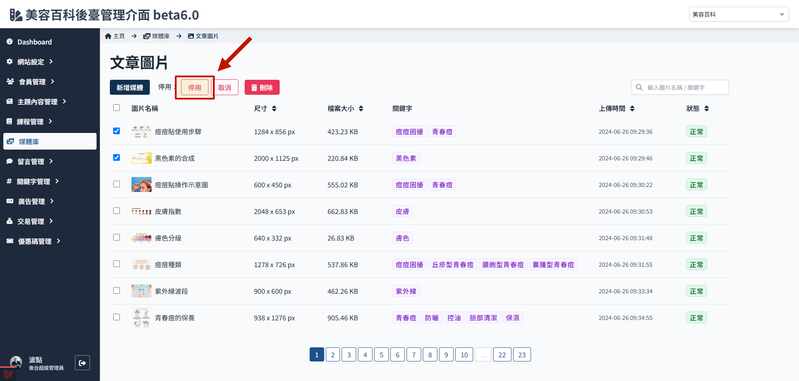

# 停用與還原媒體

停用只是暫停前端的顯示，圖片檔案位置及資料並不會變化。

> 關於媒體資料夾的編輯操作功能，參考[媒體狀態與類別](./media-status.md#類別說明)。

## 如何停用媒體

1. 媒體庫，進入文章圖片資料夾
   
2. 勾選要停用的媒體
   
3. 點擊 停用
   

## 如何還原媒體

1. 媒體庫，進入文章圖片資料夾
   
2. 勾選被停用的媒體
   
3. 點擊 取消
   
