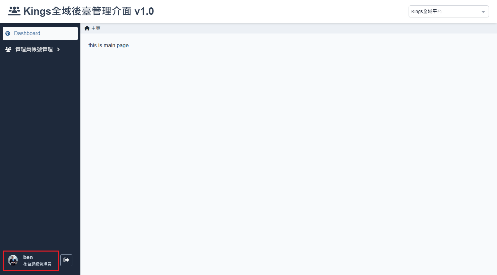
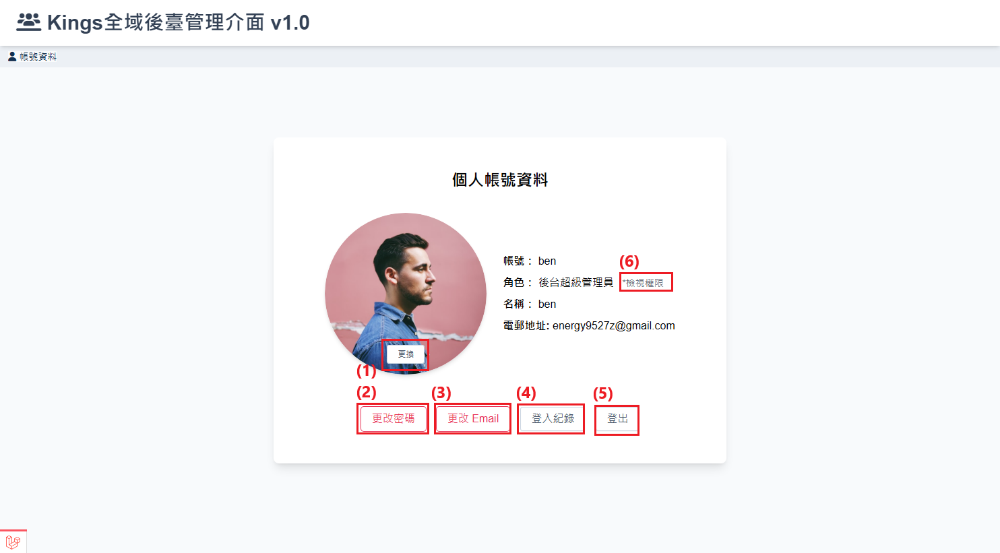

# 個人帳號資訊

此頁面顯示使用者的帳號基本資訊，包含使用者名稱、角色、名稱及聯絡的電子郵件地址。

## 如何訪問此頁面?

操作 [登入流程](./login.md) 進入到後台管理儀板表後，由畫面左下角個人資訊區塊點擊進入。

## 操作說明

-   (1)更改密碼：點擊「更改密碼」按鈕可以進行 [變更密碼](./change-passward.md) 操作，參考如何登入密碼。
-   (2)更改 Email：點擊「變更 Email」按鈕可以進行 [變更 e-mail](./change-email.md) ，參考如何變更 E-mail。
-   (3)登入紀錄：點擊「登入紀錄」按鈕可以進行 [檢視登入紀錄](./login-history.md)，查看帳號的歷史登入狀態。
-   (4)登出：點擊「登出」按鈕，退出當前帳號並返回登錄頁面。
-   (5)檢視權限：點擊「檢視權限」按鈕可以查看當前管理者帳號權限。
    
