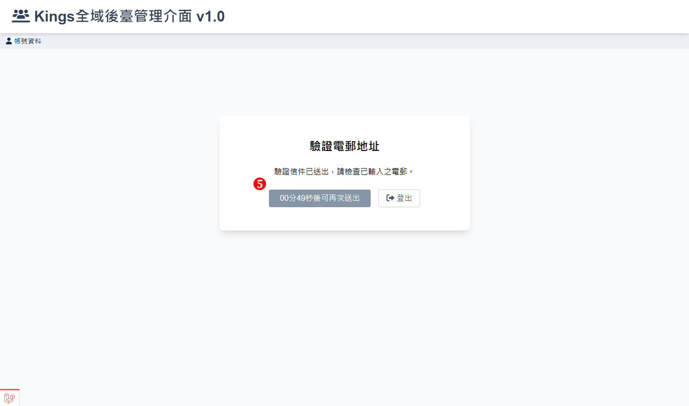

# 如何變更電子郵件

修改時需驗證管理者密碼，輸入即將替換的電子郵件，進行一系列驗證後就可以修改完成。

## 操作說明

1. 輸入密碼：請輸入當前管理者密碼進行驗證。
2. 輸入新的電子郵件地址：請輸入您想替換的新的電子郵件地址。
3. 送出：完成上述資訊的輸入後，點擊送出按鈕以發送更改請求。
   
4. 驗證電郵地址：驗證電子郵件地址：點擊「送出驗證信件」按鈕，前往綁定的電子郵件信箱查收驗證信件。
    - \*如果收不到電子信件，可能被攔截或移至垃圾郵件或垃圾桶，請檢查。
      
5. 發送請求限制：成功發送驗證信件後，畫面會提示下一次可以再次發送的時間，以防止頻繁請求。
   
6. 驗證電子郵件地址：請查收欲替換的電子郵件信箱中的驗證信，並點擊信中的「驗證電子郵件地址」連結以完成驗證流程。
   
7. 完成驗證：驗證通過後，點擊「回到系統」按鈕，即可查看管理者個人資訊中的電子郵件欄位。
   
