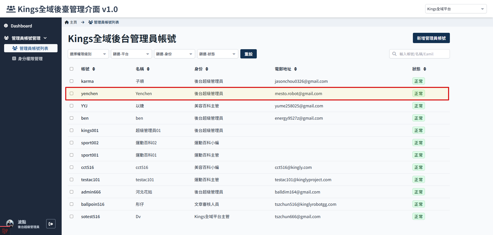
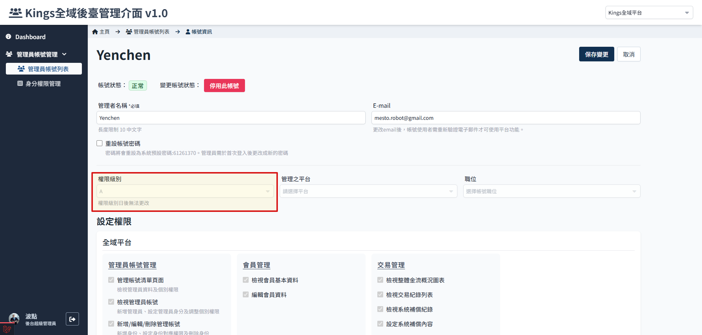
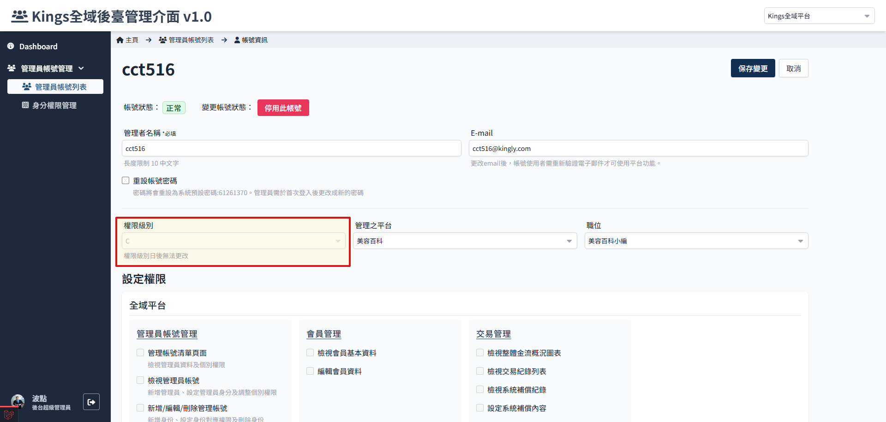
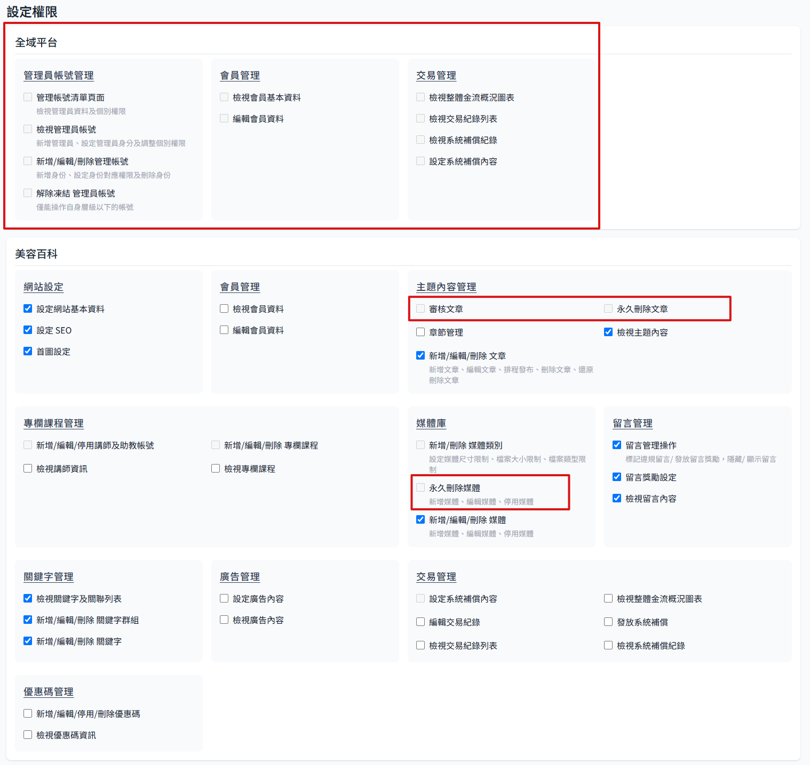
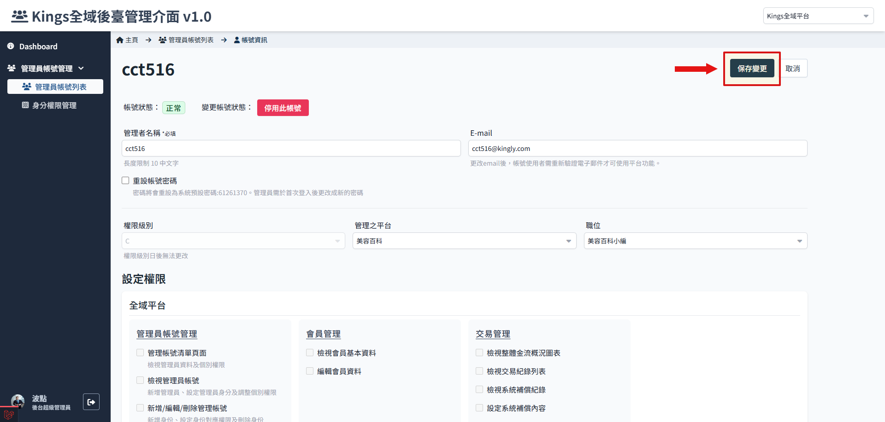

# 編輯管理員身分權限

<!-- TODO -->

1. 選擇要編輯的管理員
   

2. 進入管理員頁面，會發現不是所有欄位都可以編輯

    > 參考 [管理員帳號及身分權限說明](./administer-rules.md)，編輯權限有帳號等級的區分與限制。

     > 

    換個比較低等級的帳號，就會發現出現比較多可以編輯的功能：
    
    

3. 點選　保存變更
   
