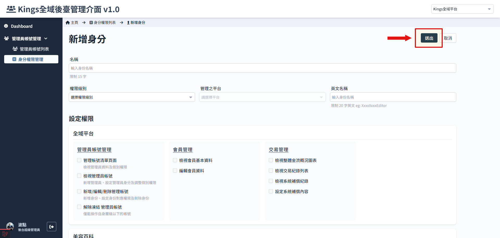

# 如何新增身分

1. 進入身份權限管理，點選新增
   

2. 設定名稱，選擇權限級別、管理平台

    - 名稱：一般來說使用職稱會比較合理。
    - 權限級別：必填，目前只能選 B 或 C，D 權限尚未開發。
    - 管理平台：依照需求選擇平台。
    - 英文名稱：填寫方便命名管理。

     
     :::danger 權限級別與管理平台設定後不可更改！
     :::

    

3. 設定功能權限

    依照所選擇的權限，這邊的功能會有一些限制，參考 [管理員帳號及身分權限說明](./administer-rules.md)，編輯權限有帳號等級的區分與限制。
    

4. 設定完後點選 送出
   
