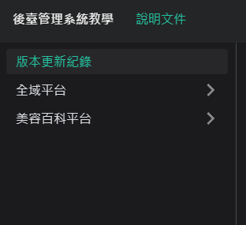
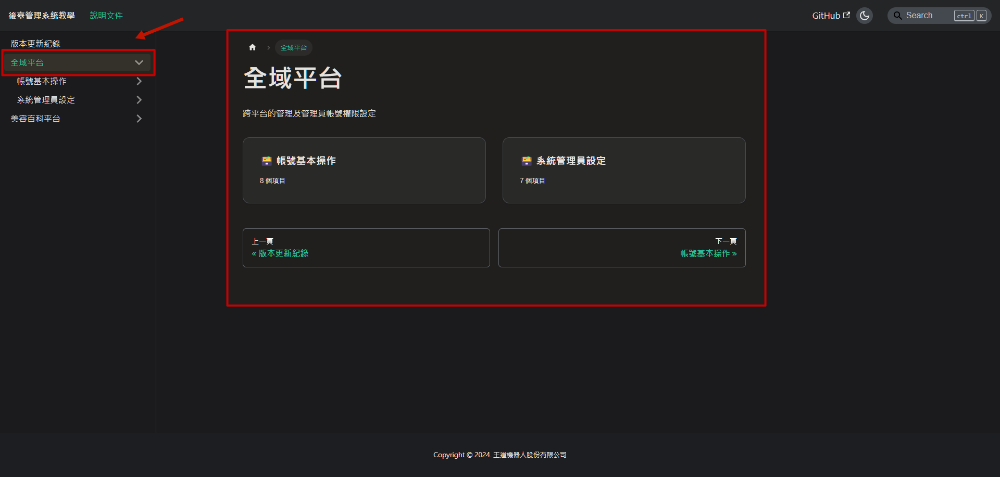
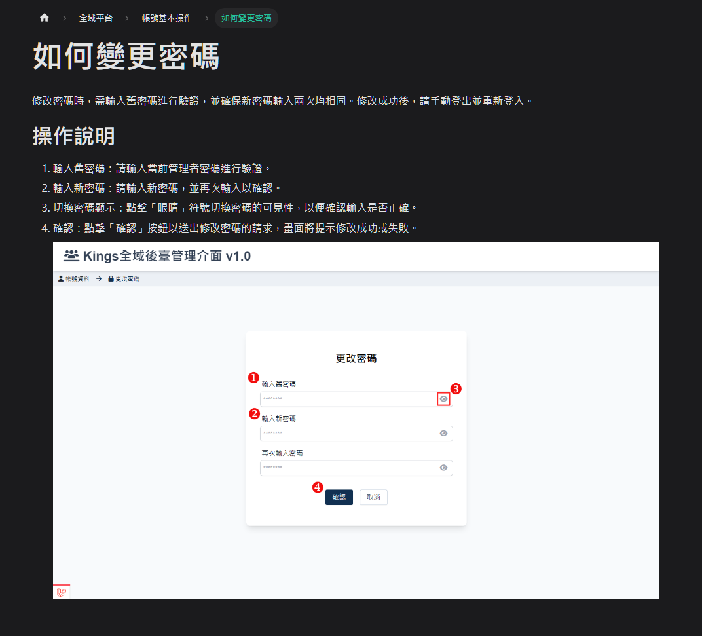
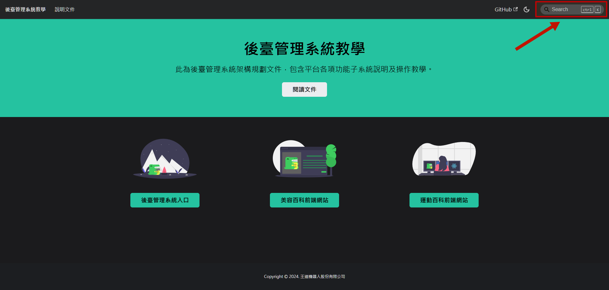
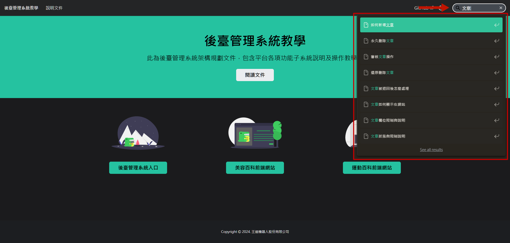
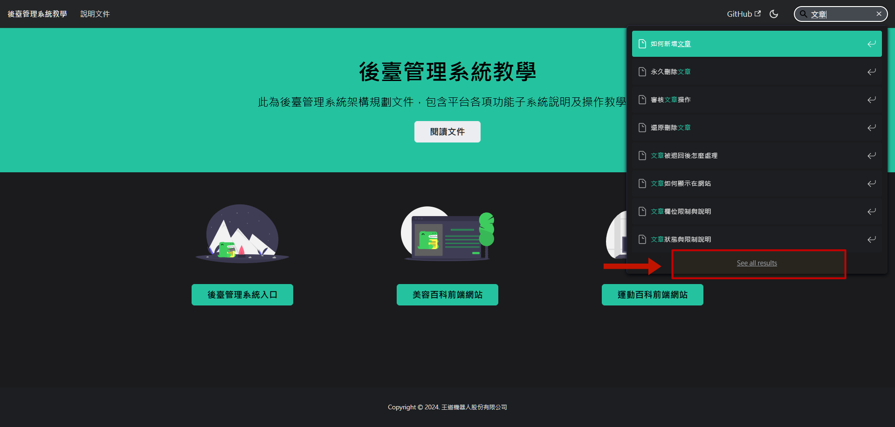
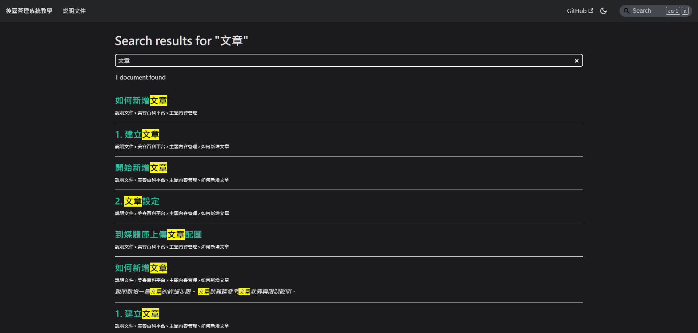

# 文件介紹及說明

本操作文件涵蓋後台各功能的操作說明，這邊簡單說明如何找到自己需要的功能。

## 依照平台找特定功能操作說明

確認要找的功能屬於哪個平台，原則上來說除了管理權限及帳號相關的功能，其他都屬於美容百科平台。

### 1. 選擇平台

從側邊攔可看到目前有 全域平台 及 美容百科平台 兩個平台。

    

### 2. 展開子選單

點擊箭頭可展開/收合子選單，顯示平台內可設置的功能列表

點擊文字，除了展開功能列表，頁面會列出該平台功能清單

### 3. 選擇功能項目

點擊進入該功能項目

### 4. 選擇需要了解的操作

例如點選　＂如何變更密碼＂

### 5. 閱讀操作說明

就可以看到變更密碼的具體流程

## 使用搜索功能

除了按照平台分類找功能外，在任何頁面都可以使用右上角搜尋功能直接輸入要搜索的內容。

### 1. 使用搜尋功能

### 2. 輸入搜索文字

輸入後會看看到下方選單出現即時搜索結果

### 3. 選取項目

可直接從搜索結果的選單內用方向鍵/滑鼠選取

### 4. 檢視全部搜索結果

點擊下方連結可跳至全部搜索結果

