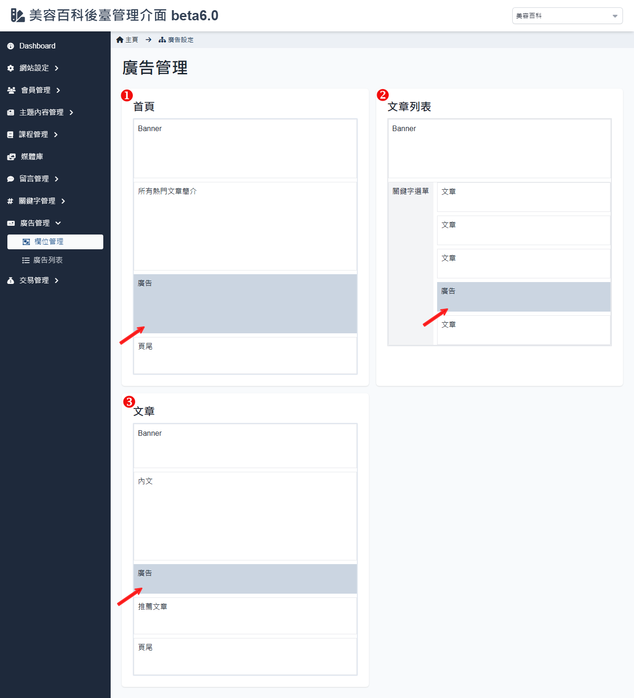

# 栏位管理

提供了管理者设置首页广告及内容显示的相关设置，方便对首页的横幅、广告等区域进行有效的管理和配置。

## 广告管理

进入栏位管理会先显示首页、文章列表以及文章内容的广告配置，显示各页面中显示的内容，并标示出广告出现的区块，点击「广告」可进入至[栏位内容设定](. /position-list.md#栏位内容设定) 进行编辑设置。

## 栏位内容设定

### 操作说明

1. **栏位标题**：显示当前设定的栏位名称。
2. **栏位内容设定**：

    - **轮播时间**：设置广告轮播时间间隔，单位为秒。例如，设定为「3」秒表示图片将显示 3 秒后自动切换。
    - **尺寸规范**：设置广告图片的建议尺寸，确保图片在显示时保持适当比例。
    - **档案大小限制**：设置可上传图片的大小上限，单位为MB。

3. **关键字设定**：

    - **关键字栏位**：可以在此输入与该栏位相关的关键字，便于分类和管理。输入完毕后点击「加入」按钮，即可将关键字添加至列表。
    - **全部清空**：点击「全部清空」按钮可以一次性清除所有已输入的关键字，方便进行重新设定。

4. **广告位置预览**：

    - **首页**：显示当前在首页配置的广告及内容显示区域，包括「Banner」、「所有热门文章简介」、「广告位置」以及「页尾」等栏位，管理者可以直观地查看配置情况。

5. **套用更新与取消操作**：

    - **套用更新**：点击「套用更新」按钮保存所有更改，使配置立即生效。
    - **取消**：点击「取消」按钮撤销所有未保存的变更，恢复至之前的设定状态。

