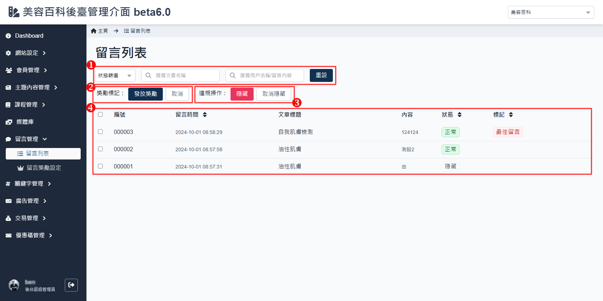

# 留言列表

提供了管理者查看和管理所有會員留言的功能，包括篩選留言、標註留言、違規操作等多項功能。

## 操作說明

1. **篩選與搜尋功能**：
    - **狀態篩選**：使用下拉選單篩選不同狀態的留言，例如「正常」、「隱藏」等。
    - **搜尋文章名稱**：輸入文章名稱，可以快速找到與該文章相關的留言。
    - **搜尋用戶名稱/留言內容**：輸入會員暱稱或留言的部分內容，快速定位到特定留言。
    - **重設按鈕**：點擊「重設」按鈕可以清除所有搜尋條件，恢復顯示全部留言。
2. **獎勵標記**：
    - **標註為最佳留言**：選中留言後，點擊「發放獎勵」按鈕，可以將該留言標註為最佳留言，[網站顯示](./comment-list.md#最佳留言) 請參考連結圖示。
    - **取消**：點擊「取消」按鈕可以取消該留言的最佳標註。
3. **違規操作**：
    - **隱藏留言**：選中留言後，點擊「隱藏」按鈕，可以將該留言設置為隱藏，避免顯示在前台，[網站顯示](./comment-list.md#隱藏留言) 請參考連結圖示。
        - 如果是最佳留言標註是無法隱藏，要先將最佳留言標註取消。
    - **取消隱藏**：點擊「取消隱藏」按鈕可將已隱藏的留言重新顯示。
4. **留言列表**：
    - **編號**：顯示留言的唯一識別碼。
        - 點擊可前往 [留言內容](./comment-content.md) ，請參考說明。
    - **留言時間**：顯示留言發表的具體時間。
    - **文章標題**：顯示該留言所屬的文章標題。
        - 點擊可前往該 [文章編輯頁面](../../beauty/content/how-to-edit-article#待審核狀態的文章)，對應 2.文章內容。
    - **內容**：顯示留言的內容。
    - **狀態**：顯示留言的當前狀態，例如「正常」或「隱藏」。

## 前台網站顯示

### 最佳留言

-   透過後台留言列表設置最佳留言之後，前台會顯示最佳留言標記，也會置頂 (功能開發中)，如下圖：
    

### 隱藏留言

-   透過後台留言列表設置隱藏之後，前台會顯示當前留言已被屏蔽，如下圖：
    
