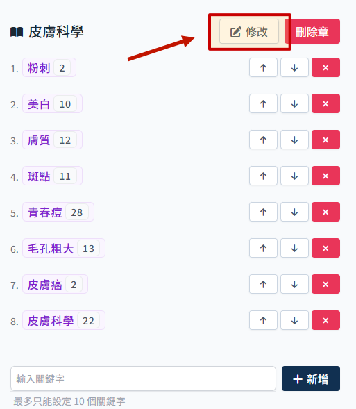

# 如何调整章节

网站内文章列表显示哪些文章，由章节管理设定。

## 进入章节管理页面

1. 点选 sidebar `主题内容管理` 展开子选单，选择 `章节管理`

2. 进入章节管理页面

章节管理这里即对应前端网站显示画面:

## 进行章调整

:::danger

做任何变动都要记得最后都需要点击 套用变更 才会生效!!

:::

### 修改章节名称

:::warning

-   章节名称不可重复。
    :::

1. 点击 `修改`

2. 此时可编辑章节名称

3. 修改完成后点击 `完成`

4. 套用变更
   

### 新增章

:::warning

-   至多上限 6 个章。
-   章节名称不可重复。
    :::

1. 输入章节名称

2. 点选 `新增 后，会出现一个新的章节栏位
   

3. 必须为新增的章添加至少一个小节
    > 参考 [新增小节](#新增小节)

### 删除章

:::warning 至少需保留一个章。
:::

1. 点击 删除章

2. 套用变更

## 小节调整

### 调整显示顺序

-   可依照需求调整小节排列顺序。

1. 点击上下方向键，可调整顺序

2. 套用变更

### 新增小节

:::warning

-   仅可新增已有的关键字作为小节。
-   最多设定 10 个关键字。
-   同个章内不可新增重复小节。

:::

1. 输入要新增的关键字

侦测到输入行为会自动出现下拉选单供选择，建议直接从下拉选单选比较不会有问题。

2. 点击新增

3. 套用变更

### 删除小节

:::warning

-   每个章至少需要设定一个小节。
    :::

1. 点击 `删除`，直接删除小节

2. 套用变更

