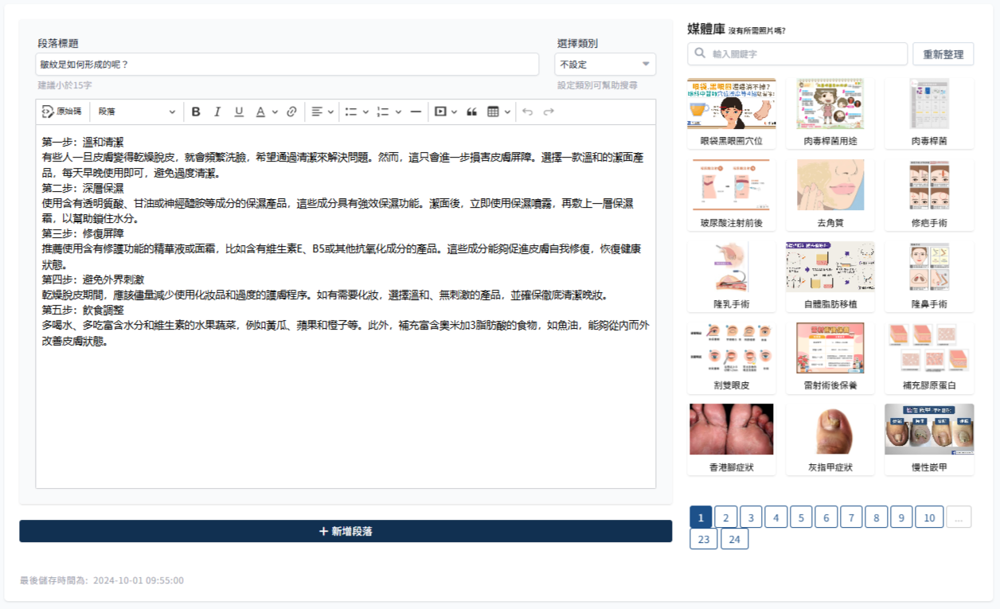

# 如何新增文章

说明新增一篇文章的详细步骤。

:::note 文章状态请参考 [文章状态与限制说明](./article-status.md)。
:::

> 范例文章下载：
> [范例文章--01](../../example-assets/article/ch01-02-003.zip)，
> [范例文章--02](../../example-assets/article/ch01-03-006.zip)，
> [范例文章--03](../../example-assets/article/ch02-01-001.zip)，
> [范例文章--04](../../example-assets/article/ch03-01-005.zip)，
> [范例文章--05](../../example-assets/article/ch05-01-006.zip)

## 前置预备

新增文章前先预备

### 到媒体库上传文章配图

> 参考[如何新增图片至媒体库](../media/how-to-add-img.md)

:::note 文章首图不需要上传媒体库。
:::

### 确认关键字是否已建立

> 参考[如何新增关键字](../keyword/how-to-add-keywords.md)

检查文章内关键字是否都已新增至关键字列表。

## 开始新增文章

上面步骤都检查后，再开始新增文章。

### 1. 建立文章

从 sidebar 点击 新增文章，输入文章标题，若检测到重覆标题会无法点击下一步，进入文章编辑页面

### 2. 文章设定

新增引言、关键字、首图，再依照各段落新增文章内容。详细条件限制参阅[文章栏位条件限制](./article-content-limit.md)。

### 3. 输入内容

依照段落设定输入内容。

:::warning 注意事项

-   检查各文章段落标题：不要写得太拢统，像是症状成因等，可以加入主题内容，像是为什么会长青春痘等等的，这样到时候前台使用段落类型搜索时，才不会有一堆看起来一样的标题。
-   表格内的换行使用 `shift` + `enter`, 避免产生表格内产生 `
` 标签，可按原始码检视。
    :::

### 4. 后续操作

文章编辑页面最下方有四个可操作的按钮，分别为预览文章、储存、送审、取消变更

-   点击预览文章后开新分页，可预览目前文章的呈现效果。
-   若尚有需补充的内容，可点击储存草稿 [4-1 储存草稿](#4-1-储存草稿)。
-   若文章已编辑完成，可点击送审，参阅 [4-2 送审](#4-2-送审)。
-   点击取消变更，会刷新页面，还原所有未储存变更。

#### 4-1. 储存草稿

不检查栏位条件限制，直接记录目前编辑状况。

#### 4-2. 送审

会检查所有栏位是否符合条件限制，参阅[文章栏位条件限制](./article-content-limit.md)。

