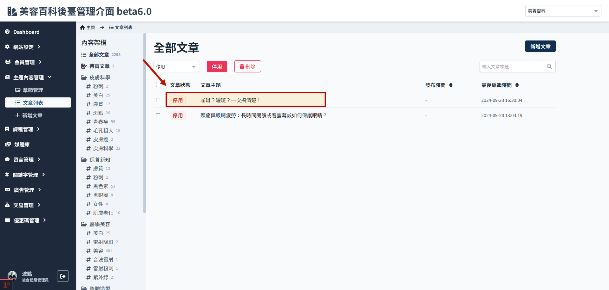
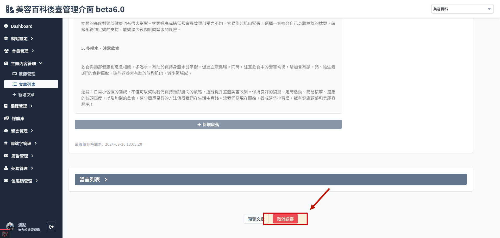
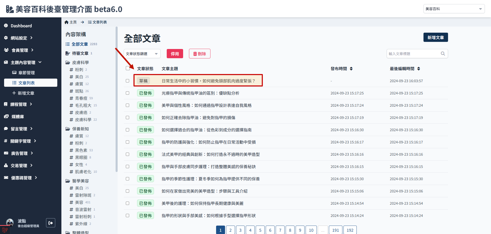

# 如何修改文章内容

仅`草稿`、`停用` 状态的文章可进行编辑。

> 文章状态请参考[文章栏位限制与说明](./article-status.md)。

### 发布状态的文章

1. 进入文章列表
   

2. 选取要修改的文章
   

3. 点击停用
   

4. 此时文章状态会变成停用状态
   

5. 进入文章内容页面就会看到栏位变成可编辑状态
   

### 待审核状态的文章

1. 进入文章列表，选取要修改的文章
   

2. 进入文章内容页面
   

3. 拉到底部，选择取消送审，此时进入文章内容页面就会看到栏位变成可编辑状态
   

4. 从文章列表检视，文章会变成停用状态
   
