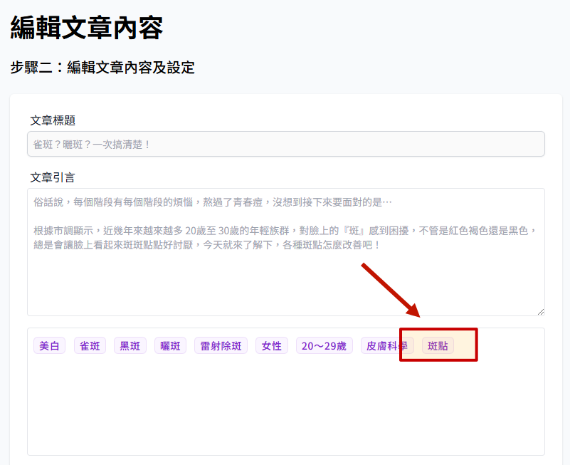

# 文章如何显示在网站

说明文章在前端网站显示的逻辑及设定关键字与文章之间的关系。

## 文章显示的条件

:::warning
必须同时满足以下条件，文章才能够显示在前端网站。
:::

### 文章的状态

> 参考 [如何新增文章](./how-to-add-article.md)、[文章栏位限制与说明](./article-status.md)

-   文章是是否为 `已发布` 状态，仅有已发布状态才可在网站上显示。
    

### 关键字设定

-   确认文章所设定的关键字包含哪些。
-   设定关键字的时候尽量不要只设定一个，这样不管是搜索功能或是文章列表都可增加显示机率。
    

### 章节调整

> 参考 [如何调整章节](./chapter-manage.md)

-   确定文章内的关键字是否有任一出现在章节管理内。
-   如果没有任何文章设定的关键字被设定为小节，文章即不会显示在文章列表。
-   文章设定的关键字有出现在前端
    

-   可看到新增的文章
    
