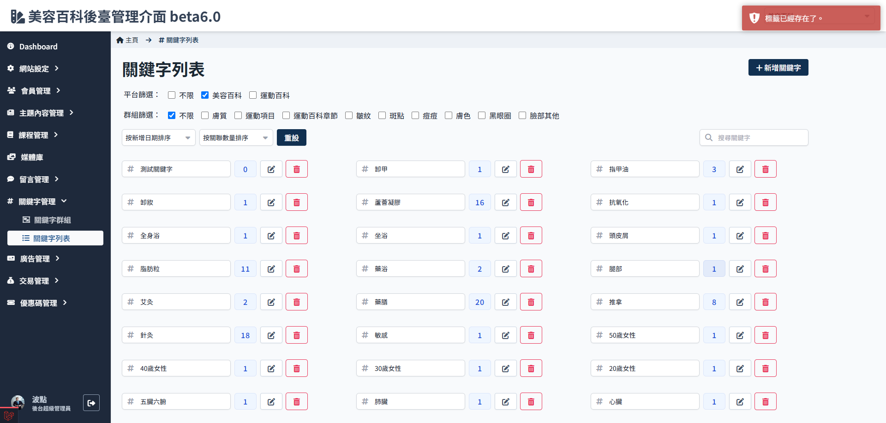

# 编辑关键字名称

可随时编辑修改关键字名称，但名称不可重复。

:::warning
关键字名称修改并不会影响关联。  
举例来说，ABCD 四篇文章设定了「痘痘」这个关键词，把「痘痘」变更为「青春痘」，那与ABCD 关联依然存在，检视文章列表或文章资讯页会看到原先「痘痘」关键字全部改为「青春痘」，并不需要额外重新设定。
:::

### 操作流程

1. 进入关键字列表，点击 `编辑`
   

2. 修改名称
   

3. 点击 `保存`，系统会判断是否与现有关键字有重复

    3.1 若编辑后的名称有重复，会储存失败，回复成修改前
    

    3.2 检测无重复，即变更成功
    
