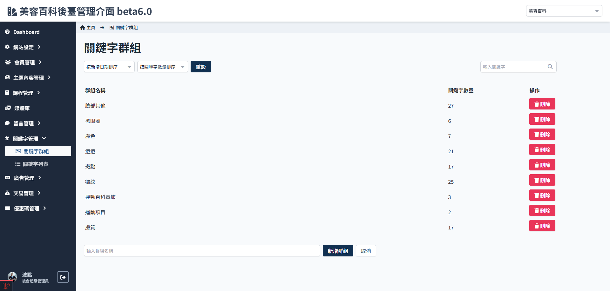

# 关键字群组可以做什么

关键字群组的功能是帮助筛选及检视目前已有的关键字，避免某个主题类型的关键字过多或者相似度过高，影响关联结果。

## 设定群组内容

1. 进入关键字群组列表页面
   

2. 点选要修改的群组
   

3. 进入关键字群组设定页面
   

4. 可透过输入框筛选/寻找关键字，
   

5. 点选关键字，即可看到他跳转到右边
   
   

6. 储存变更
   

## 修改群组名称

1. 进入关键字群组设定页面
   

2. 点选 修改名称
   

3. 点击　完成
   

4. 点选 储存变更

:::warning
保存变更后会送出资料，若检测到重复名称会无法储存变更，且会回复所有变更！ ！
:::

## 删除关键字群组

1. 进入关键字群组
   

2. 点选删除
   :::danger
   因为关键字只是辅助管理关键字，并不影响网站前端的各项显示，因此这里的删除并没有二次确认、亦无法回复操作行为。
   :::
   

3. 删除成功
   
