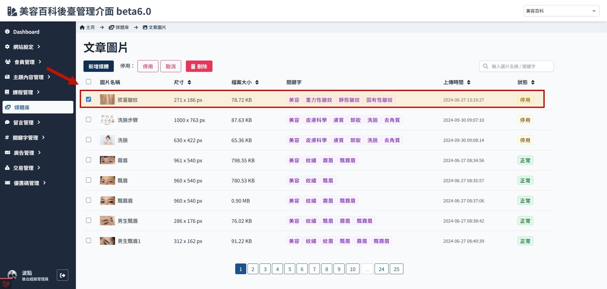

# 停用与还原媒体

停用只是暂停前端的显示，图片档案位置及资料并不会变化。

> 关于媒体资料夹的编辑操作功能，参考[媒体状态与类别](./media-status.md#类别说明)。

## 如何停用媒体

1. 媒体库，进入文章图片资料夹
   
2. 勾选要停用的媒体
   
3. 点击 停用
   

## 如何还原媒体

1. 媒体库，进入文章图片资料夹
   
2. 勾选被停用的媒体
   
3. 点击 取消
   
