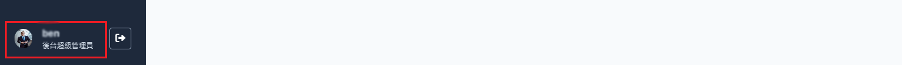

# 个人帐号资讯

显示管理者的帐号基本资讯，包含管理者帐号、角色、名称及联络的电子邮件地址。

## 如何访问此页面?

1. 操作 [登入流程](./login.md) 进入到后台管理仪板表后，由画面左下角个人资讯区块点击进入。
   

## 操作说明

1. 更改密码：点击「更改密码」按钮可以进行 [变更密码](./change-passward.md) 操作，参考如何登入密码。
2. 更改 Email：点击「变更 Email」按钮可以进行 [变更 e-mail](./change-email.md) ，参考如何变更电子邮件。
3. 登入纪录：点击「登入纪录」按钮可以进行 [检视登入纪录](./login-history.md)，查看帐号的历史登入状态。
4. 登出：点击「登出」按钮，退出当前帐号并返回登录页面。
5. 检视权限：点击「检视权限」按钮可以查看当前管理者帐号权限。
   
