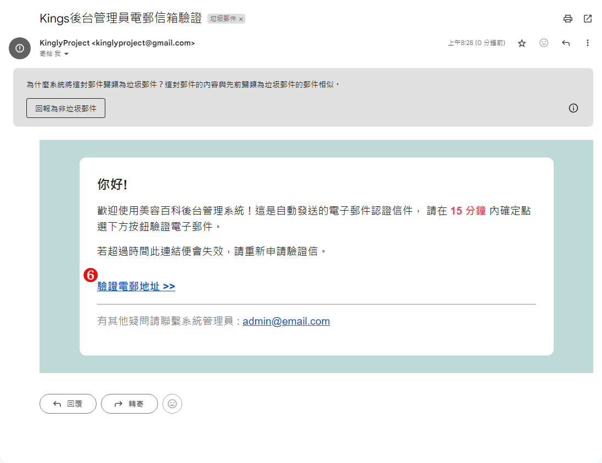

# 如何变更电子邮件

修改时需验证管理者密码，输入即将替换的电子邮件，进行一系列验证后就可以修改完成。

## 操作说明

1. 输入密码：请输入当前管理者密码进行验证。
2. 输入新的电子邮件地址：请输入您想替换的新的电子邮件地址。
3. 送出：完成上述资讯的输入后，点击送出按钮以发送更改请求。
   
4. 验证电邮地址：验证电子邮件地址：点击「送出验证信件」按钮，前往绑定的电子邮件信箱查收验证信件。

    - \*如果收不到电子信件，可能被拦截或移至垃圾邮件或垃圾桶，请检查。
      

5. 发送请求限制：成功发送验证信件后，画面会提示下一次可以再次发送的时间，以防止频繁请求。
   
6. 验证电子邮件地址：请查收欲替换的电子邮件信箱中的验证信，并点击信中的「验证电子邮件地址」连结以完成验证流程。
   
7. 完成验证：验证通过后，点击「回到系统」按钮，即可查看管理者个人资讯中的电子邮件栏位。
   
