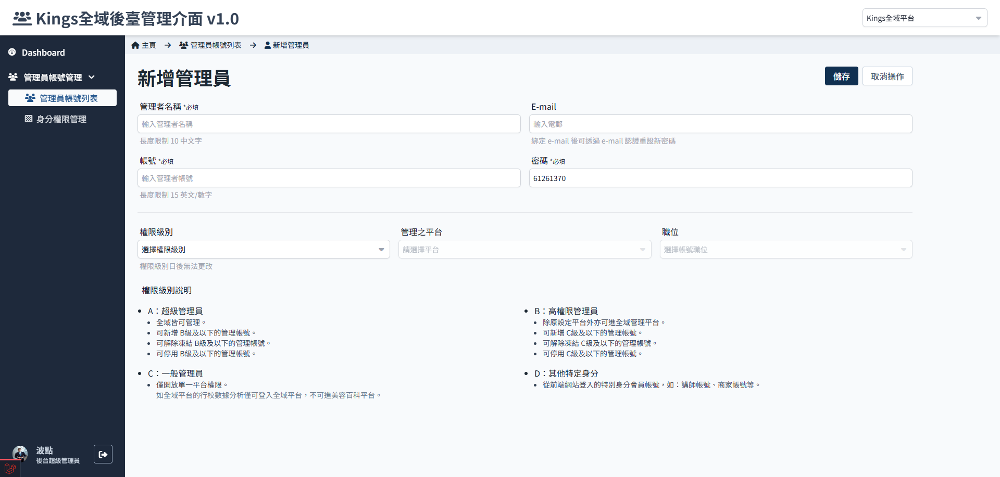

# 如何新增管理员

## 权限限制

B 级以上管理员才有操作权限，参考 [管理员帐号及身分权限说明](./administer-rules.md)。

## 操作流程

1.  进入管理员列表页面
    

2.  点选新增管理员
    

3.  进入新增管理员页面
    

4.  输入基本资料、设定帐号等级和身分。

    -   名称：方便辨识使用者，建议直接打名字。
    -   帐号：管理员登入使用。
    -   E-mail：可设定可不设，若没有设定那管理员帐号首次登入时也会要求输入，参考[首次登入帐号](../account/change-passward.md)。
    -   密码：可设定预设值，反正首次登入时会要求重新设定，参考[首次登入帐号](../account/change-passward.md)。 。
    -   权限级别：会影响帐号可以设定的身分，参考 [管理员帐号及身分权限说明](./administer-rules.md)。
    -   管理之平台：依照帐号权限级别的设定，可选择的管理平台会有差异。
    -   职位：仅可选择权限级别相同的身份职位，参考[如何新增身份](./how-to-add-a-role.md)。

      
     :::danger 特别注意
     权限级别设定后不可更改!! 若有疑虑务必参考 [管理员帐号及身分权限说明](./administer-rules.md) 了解差异后再行设定。
     :::

1.  设定完成，点选 储存

